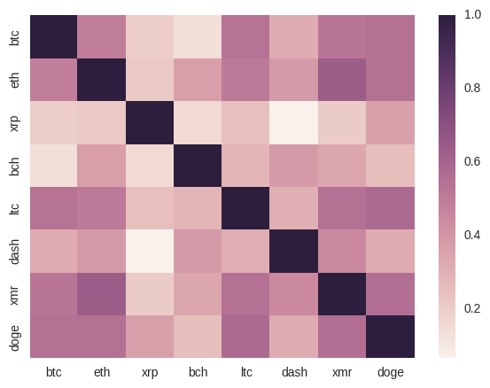
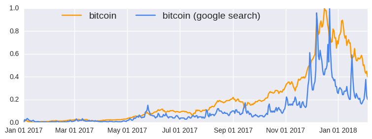

# cryptory

Retrieve historical cryptocurrency and other related data.

`cryptory` integrates various sources of historical crypto data, so that you can perform analysis and build models without having to worry about knowing different packages and APIs. Current data sources include:

-  Daily historical prices
-  Additional cryptocurrency information (transaction fees, active adressess, etc.)
-  Reddit metrics (e.g. subscriber growth)
-  Google Trends (via [Pytrends](https://github.com/GeneralMills/pytrends))
-  Stock market
-  Foreign exchange rates
-  Commodity prices


## Installation

```bash
$ pip install cryptory
```

### Compatibility

* Python 2.7+
* Python 3

### Dependencies

-  pandas>=0.17.0
-  numpy>=1.10.0
-  pytrends>=4.0.0
-  beautifulsoup4>=4.0.0

## How to Use

Consult the documentation `help(Cryptory)` for more information on its usage.

### Basic Usage

```python
# load package
from cryptory import Cryptory

# initialise object 
# pull data from start of 2017 to present day
my_cryptory = Cryptory(from_date = "2017-01-01")

# get historical bitcoin prices from coinmarketcap
my_cryptory.extract_coinmarketcap("bitcoin")
```

```python
# get daily subscriber numbers to the bitcoin reddit page
my_cryptory.extract_reddit_metrics(subreddit="bitcoin",
                                    metric="total-subscribers")
```


```python
# google trends- bitcoin search results
my_cryptory.get_google_trends(kw_list=["bitcoin"])
```


```python
# dow jones price (market code from yahoo finance)
my_cryptory.get_stock_prices(market="%5EDJI")
```


```python
# USD/EUR exchange rate
my_cryptory.get_exchange_rates(from_currency="USD", to_currency="EUR")
```

```python
# get historical commodity prices
my_cryptory.get_metal_prices()
```


### Advanced Usage

As all `cryptory` methods return a pandas dataframe, it's relatively easy to combine results and perform more complex calculations.


```python
# generate price correlation matrix
import pandas as pd
import seaborn as sns
import matplotlib.pyplot as plt

all_coins_df = my_cryptory.extract_bitinfocharts("btc")
# coins of interest
bitinfocoins = ["btc", "eth", "xrp", "bch", "ltc", "dash", "xmr", "doge"]
for coin in bitinfocoins[1:]:
    all_coins_df = all_coins_df.merge(my_cryptory.extract_bitinfocharts(coin), on="date", how="left")
# date column not need for upcoming calculations
all_coins_df = all_coins_df.drop('date', axis=1)
corr = all_coins_df.pct_change().corr(method='pearson')
fig, ax = plt.subplots(figsize=(7,5))  
sns.heatmap(corr, 
            xticklabels=[col.replace("_price", "") for col in corr.columns.values],
            yticklabels=[col.replace("_price", "") for col in corr.columns.values],
            annot_kws={"size": 16})
plt.show()
```





```python
# overlay bitcoin price and google searches for bitcoin
btc_google = my_cryptory.get_google_trends(kw_list=['bitcoin']).merge(
    my_cryptory.extract_coinmarketcap('bitcoin')[['date','close']], 
    on='date', how='inner')

# need to scale columns (min-max scaling)
btc_google[['bitcoin','close']] = (
        btc_google[['bitcoin', 'close']]-btc_google[['bitcoin', 'close']].min())/(
        btc_google[['bitcoin', 'close']].max()-btc_google[['bitcoin', 'close']].min())

fig, ax1 = plt.subplots(1, 1, figsize=(9, 3))
ax1.set_xticks([datetime.date(j,i,1) for i in range(1,13,2) for j in range(2017,2019)])
ax1.set_xticklabels([datetime.date(j,i,1).strftime('%b %d %Y') 
                     for i in range(1,13,2) for j in range(2017,2019)])
ax1.plot(btc_google['date'].astype(datetime.datetime),
             btc_google['close'], label='bitcoin', color='#FF9900')
ax1.plot(btc_google['date'].astype(datetime.datetime),
             btc_google['bitcoin'], label="bitcoin (google search)", color='#4885ed')
ax1.legend(bbox_to_anchor=(0.1, 1), loc=2, borderaxespad=0., ncol=2, prop={'size': 14})
plt.show()
```





## Issues & Suggestions

`cryptory` relies quite strongly on scraping, which means that it can break quite easily. If you spot something not working, then [raise an issue](https://github.com/dashee87/cryptory/issues). Also, if you have any suggestions or criticism, you can also [raise an issue](https://github.com/dashee87/cryptory/issues).
